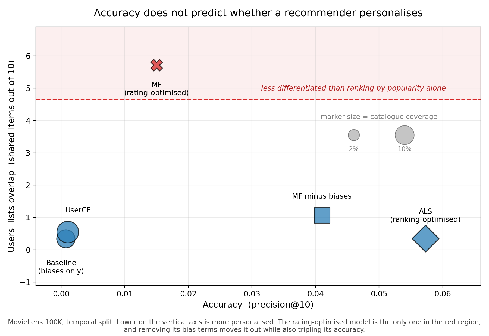

# recaudit

**Accuracy scores do not tell you whether a recommender personalises.**

A recommender can score well on precision, NDCG or RMSE while sending almost
everyone to the same small set of items. Standard evaluation cannot detect this,
because every common metric is computed per user and then averaged, which makes
population-level behaviour invisible by construction.

`recaudit` reports what those metrics hide, for any recommender, in five lines.

---

## The finding that motivated it

On MovieLens, a standard rating-optimised matrix factorisation model produces
recommendations that are **less differentiated between users than ranking by
popularity while ignoring the user entirely**.

| | shared items between two random users (out of 10) |
|---|---|
| random recommendations | 0.01 |
| **matrix factorisation (rating-optimised)** | **5.72** |
| popularity ranking, user ignored | 4.65 |
| ALS (ranking-optimised) | 0.35 |

Seven films fill half of every recommendation slot in the system. One film
appears for 94% of users. The model covers 2.3% of the catalogue.

None of this is visible in its accuracy score.

The result replicates on MovieLens 1M (6,040 users, 1,000,209 ratings), where
the gap is wider: 6.49 shared items against a popularity reference of 4.47.



## The cause

The bias terms. A standard biased matrix factorisation learns a per-user bias
("this person rates generously") and a per-item bias ("this film is well liked").
Those absorb most of the variance in ratings, which is why they are standard
practice and why they improve rating prediction. But an item bias is the *same
number for every user*, so it pushes the same films toward the top of everyone's
list.

Removing them:

| | precision@10 | shared items | coverage |
|---|---|---|---|
| full model (biases + factors) | 0.0150 | 5.72 | 2.3% |
| **factors only, no biases** | **0.0410** | **1.07** | **6.2%** |

Personalisation improves by 81% and accuracy *nearly triples*. This is not a
trade-off. The bias terms help the task they were designed for (rating
prediction) and hurt the task recommendation actually is (ranking).

---

## Usage

```python
from recaudit import audit

report = audit(
    recommend=lambda user, n: my_model.top_n(user, n),
    train=train_df,       # columns: userId, movieId, rating
    test=test_df,         # optional, needed for accuracy metrics
    n=10,
)
print(report)
```

The only requirement is a function returning the top `n` item ids for a user, so
this works with any library or a hand-written model.

Example output:

```
  PERSONALISATION
    mean shared items between 2 users  5.72 of 10
    popularity-only reference          4.65 of 10
    WARNING: lists overlap as much as or more than ranking by popularity alone.
             This model may not be personalising.
    most recommended item reaches      93.9% of users
```

### What it reports

| group | measures |
|---|---|
| accuracy | precision@n, recall@n, NDCG@n |
| concentration | catalogue coverage, items filling half of all slots, Gini |
| popularity bias | mean popularity percentile of recommendations, vs catalogue |
| personalisation | mean overlap between users, against a popularity baseline |
| history effect | whether personalisation improves as a user's history grows |

The popularity baseline is the important part. Overlap on its own is hard to
interpret; overlap measured against a system that ignores the user entirely is
not.

---

## Reproducing the experiments

```bash
pip install numpy pandas scipy matplotlib implicit
python data.py                      # download and split
python exp1_split_comparison.py     # random vs temporal evaluation
python exp2_ranking_and_bias.py     # ranking metrics, error breakdown
python exp3_feedback_loop.py        # feedback simulation with controls
python exp4_robustness.py 0.2 12    # reliance sweep
python exp5_interventions.py        # re-ranking interventions
python exp6_personalisation.py      # personalisation vs references
python benchmark.py                 # against implicit's ALS and BPR
python make_figure.py
```

## Findings, in order

1. **Evaluation protocol matters.** Holding out each user's *most recent*
   ratings rather than a random sample makes every model 3.6–5.1% worse and
   changes the gaps between them. Published numbers using random splits are
   optimistic.
2. **Rating accuracy barely predicts recommendation quality.** Matrix
   factorisation is 6% better than a bias-only baseline on RMSE and 21× better
   on precision@10.
3. **Recommendation concentrates consumption, but not gradually.** Following
   recommendations reduces the number of distinct items reaching users roughly
   threefold versus random choice. Concentration is set immediately and does not
   compound over 20 rounds of retraining on the system's own output. Three
   controls: no retraining, random recommendations, and a sweep over how much
   users rely on the system.
4. **Diversity re-ranking works within a list, not across the catalogue.**
   MMR-style re-ranking raises genres per list by 44% for under 4% accuracy
   loss, but leaves catalogue coverage unchanged. A popularity penalty destroys
   accuracy without improving coverage.
5. **The concentration is not personalised** (above), and this is caused by the
   bias terms (above).

## Honest limitations

- Two datasets, both MovieLens. The domain is films; the result may not
  transfer to other catalogues.
- The feedback-loop simulation uses simulated users whose behaviour we specified.
  Its assumptions are stated in `exp3_feedback_loop.py` and it is the least
  well-grounded part of this work.
- Our popularity-aware modification to ALS (`our_als.py`, `beta`) gives a small
  accuracy gain (+0.0026, seed spread 0.0017 over 5 seeds) and **no meaningful
  coverage gain**. Reported as a negative result.
- The metrics here are not new; the contribution is packaging them with a
  meaningful reference point, and the evidence that accuracy cannot substitute
  for them.

## References

- Hu, Koren & Volinsky (2008). *Collaborative Filtering for Implicit Feedback
  Datasets.* ICDM. — the ALS method reimplemented in `our_als.py`
- Koren, Bell & Volinsky (2009). *Matrix Factorization Techniques for
  Recommender Systems.* IEEE Computer. — the biased MF in `models.py`
- Rendle et al. (2009). *BPR: Bayesian Personalized Ranking from Implicit
  Feedback.* UAI.
- Harper & Konstan (2015). *The MovieLens Datasets: History and Context.*
  ACM TiiS.

## Licence

MIT.
